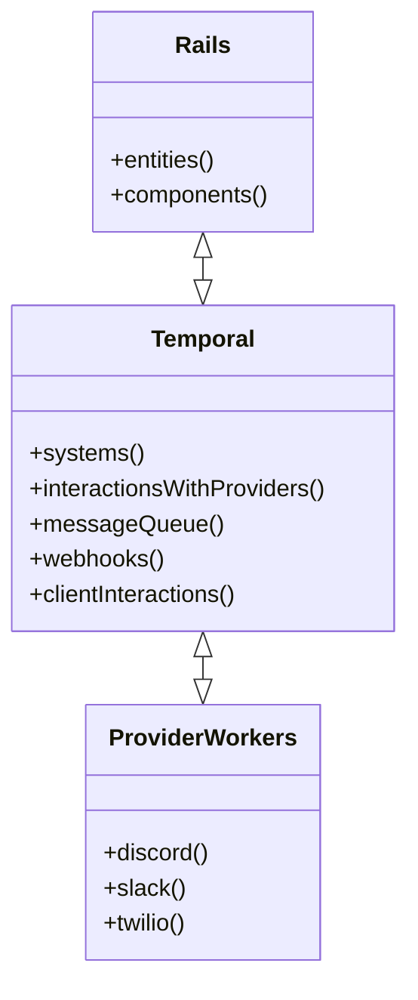

 # Koala Nexus: Universal Messaging Platform

 Koala Nexus is a provider-agnostic solution that allows supporting complex interactions with messaging providers in an unified way.
 Borrowing concepts from [Entity Component System](https://en.wikipedia.org/wiki/Entity_component_system) and [Actor Model](https://en.wikipedia.org/wiki/Actor_model), Koala Nexus allows to maintain a simple and consistent interface for interacting with messaging providers, while allowing to use the full power of the underlying provider.

## Features
* Providers
    * [ ] [Discord](https://discord.com/)
    * [ ] [Slack](https://slack.com/)
    * [ ] [Twilio](https://twilio.com/)

## Architecture Diagram

## Logic Flow Example